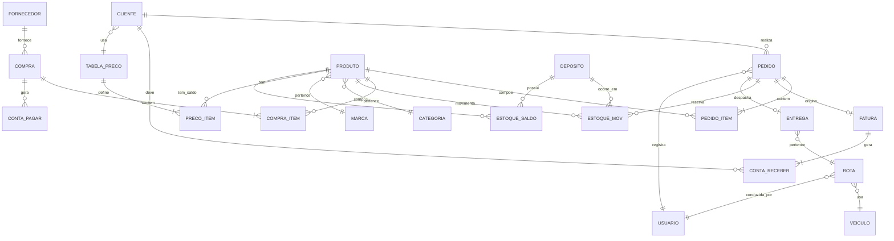
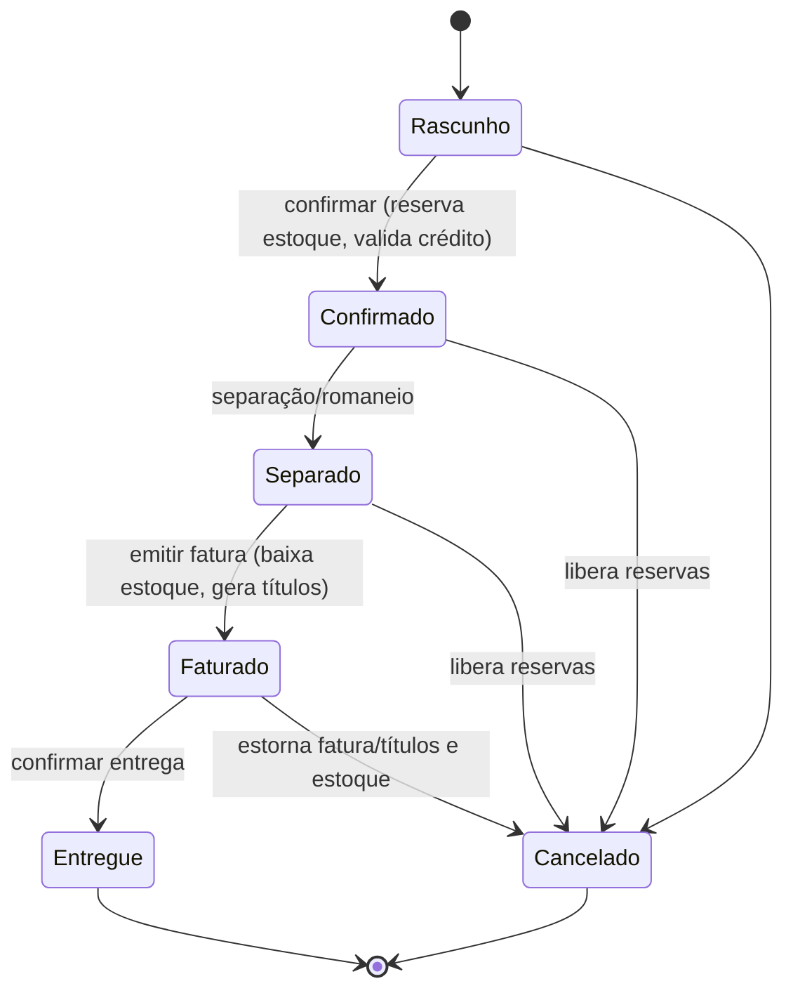

# 03 — Modelo de Domínio e Dados

## 3.1 Diagrama de entidades (visão macro)

## 3.2 Principais entidades

### Cadastros
- **Usuario**: `id, nome, email, senha_hash, perfil_id, ativo`.
- **Perfil / Permissao**: RBAC — perfil agrupa permissões (`modulo`, `acao`).
- **Categoria**: `id, nome, descricao`.
- **Marca**: `id, nome`.
- **Produto**: `id, sku, ean, nome, categoria_id, marca_id, unidade,
  fator_conversao, retornavel, ncm, ativo`.
- **Cliente**: `id, tipo (PF/PJ), nome_razao, documento (CPF/CNPJ), inscricao_estadual,
  email, telefone, limite_credito, tabela_preco_id, ativo`.
- **Endereco**: `id, cliente_id, logradouro, numero, bairro, cidade, uf, cep, tipo`.
- **Fornecedor**: `id, razao_social, cnpj, contato`.
- **Transportadora / Veiculo**: dados de logística.
- **TabelaPreco / PrecoItem**: `tabela_preco_id, produto_id, preco, desconto_max`.

### Estoque
- **Deposito**: `id, nome, endereco`.
- **EstoqueSaldo**: `produto_id, deposito_id, quantidade, reservado`
  (disponível = `quantidade - reservado`).
- **EstoqueMov**: `id, produto_id, deposito_id, tipo (ENTRADA/SAIDA/AJUSTE/RESERVA),
  quantidade, lote, validade, origem (compra/pedido/inventario), data, usuario_id`.

### Compras
- **Compra**: `id, fornecedor_id, data, status, valor_total`.
- **CompraItem**: `id, compra_id, produto_id, quantidade, custo_unit`.

### Vendas
- **Pedido**: `id, cliente_id, usuario_id, data, status, subtotal, desconto,
  frete, total, observacao`.
- **PedidoItem**: `id, pedido_id, produto_id, quantidade, preco_unit, desconto,
  total_item`.

### Faturamento e Financeiro
- **Fatura**: `id, pedido_id, numero, data_emissao, valor, dados_fiscais`.
- **ContaReceber**: `id, cliente_id, fatura_id, vencimento, valor, valor_pago,
  status (ABERTO/PARCIAL/PAGO/ATRASADO)`.
- **ContaPagar**: `id, fornecedor_id, compra_id, vencimento, valor, valor_pago, status`.

### Logística
- **Entrega**: `id, pedido_id, rota_id, status, data_entrega, recebedor, ocorrencia`.
- **Rota**: `id, veiculo_id, motorista_id, data`.
- **Veiculo**: `id, placa, capacidade`.

## 3.3 Regras de negócio-chave

1. **Reserva de estoque**: ao confirmar um pedido, o sistema cria movimentos de
   RESERVA e incrementa `EstoqueSaldo.reservado`. Só é possível reservar até o
   saldo disponível (`quantidade - reservado`).
2. **Baixa de estoque**: a saída efetiva ocorre no faturamento (ou na separação,
   conforme parametrização), convertendo reserva em SAIDA.
3. **Limite de crédito**: a confirmação de pedido valida
   `contas_receber_em_aberto + total_pedido <= limite_credito` (bloqueio ou alerta,
   conforme parâmetro).
4. **Fatura → título**: a emissão de fatura gera uma ou mais `ContaReceber`
   conforme condição de pagamento (à vista, parcelado).
5. **Cancelamento**: cancelar um pedido faturado exige estorno da fatura e dos
   títulos, e devolução das reservas/saídas ao estoque.
6. **Conversão de unidades**: quantidades podem ser informadas em caixa/fardo e
   convertidas para a unidade base via `fator_conversao`.
7. **Retornáveis/cascos**: quando aplicável, o casco é controlado como item
   separado, com saldo próprio e possibilidade de retorno na entrega.
8. **Auditoria**: toda movimentação de estoque e financeira registra usuário,
   data/hora e origem, de forma imutável.

## 3.4 Estados do pedido

