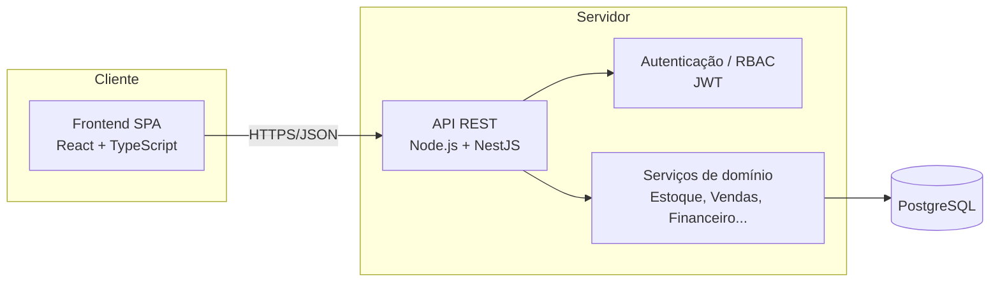

# 04 — Arquitetura e Stack Tecnológica

## 4.1 Visão geral da arquitetura

Arquitetura **web cliente-servidor** com API REST, separando frontend (SPA),
backend (API + regras de negócio) e banco de dados relacional.



## 4.2 Stack recomendada

A stack abaixo é uma **recomendação** pragmática, com forte ecossistema, tipagem
estática ponta a ponta e boa produtividade. Alternativas equivalentes estão
listadas para não travar decisões da equipe.

| Camada | Escolha recomendada | Alternativas |
|--------|---------------------|--------------|
| **Frontend** | React 18 + TypeScript + Vite | Next.js, Vue 3 |
| **UI** | Componentes + Tailwind CSS (ou MUI) | Chakra UI, Ant Design |
| **Backend** | Node.js (LTS) + NestJS + TypeScript | Fastify puro, Django/DRF, Spring Boot |
| **ORM** | Prisma | TypeORM, Drizzle |
| **Banco** | PostgreSQL | MySQL/MariaDB |
| **Auth** | JWT (access + refresh) + RBAC | Sessões server-side |
| **Testes** | Vitest/Jest (unit) + Supertest (API) + Playwright (E2E) | — |
| **Infra dev** | Docker Compose (Postgres) | Postgres local |
| **CI** | GitHub Actions (lint + testes + build) | — |

### Justificativa
- **TypeScript ponta a ponta** reduz erros e facilita compartilhar tipos/DTOs.
- **NestJS** traz estrutura modular (módulos por domínio), injeção de dependência
  e boas práticas prontas — adequado a um ERP com muitos módulos.
- **PostgreSQL** oferece integridade transacional (essencial para estoque e
  financeiro), tipos ricos e boa performance analítica para relatórios.
- **Prisma** dá migrations versionadas e acesso a dados tipado.

## 4.3 Estrutura de pastas proposta (monorepo)

```
distribuidora/
├── apps/
│   ├── api/                 # Backend NestJS
│   │   ├── src/
│   │   │   ├── modules/     # auth, produtos, clientes, estoque, vendas, ...
│   │   │   ├── common/      # filtros, guards, interceptors, utils
│   │   │   └── main.ts
│   │   ├── prisma/          # schema.prisma + migrations
│   │   └── test/
│   └── web/                 # Frontend React + Vite
│       ├── src/
│       │   ├── pages/
│       │   ├── components/
│       │   ├── features/    # por domínio
│       │   └── lib/         # api client, auth, hooks
│       └── index.html
├── packages/
│   └── shared/              # tipos/DTOs compartilhados
├── docker-compose.yml       # Postgres para desenvolvimento
├── package.json             # workspaces (pnpm)
└── docs/
```

## 4.4 Padrões e decisões técnicas

- **Camadas no backend**: Controller → Service → Repository (Prisma). Regras de
  negócio nos Services; transações do banco para operações compostas
  (ex.: confirmar pedido = reserva + validação de crédito).
- **DTOs e validação**: `class-validator`/`zod` para entrada; nunca confiar no cliente.
- **Erros padronizados**: filtro global de exceções, respostas HTTP consistentes.
- **Paginação e filtros** em todas as listagens.
- **Migrations versionadas** (Prisma Migrate); nunca alterar schema à mão em produção.
- **Seeds** para dados de exemplo em desenvolvimento (usuários, produtos, clientes).
- **Configuração por ambiente** via `.env` (com `.env.example` versionado).
- **Logs estruturados** (JSON) e health check (`/health`).

## 4.5 Ambientes

| Ambiente | Descrição |
|----------|-----------|
| **Desenvolvimento** | Local, com Postgres via Docker Compose e hot reload (`pnpm dev`) |
| **CI** | GitHub Actions: lint, testes, build |
| **Homologação** | Deploy de validação com dados de teste |
| **Produção** | Deploy final; backups automáticos; HTTPS obrigatório |

## 4.6 Considerações fiscais e de conformidade

- O modelo já prevê campos fiscais (NCM, CFOP, impostos) para viabilizar a
  integração futura com um **provedor de NF-e** (ex.: via API de terceiros),
  evitando reescrita de schema.
- **LGPD**: minimização de dados pessoais, controle de acesso e trilha de auditoria.
- Valores monetários armazenados como inteiros (centavos) ou `numeric` para evitar
  erros de ponto flutuante.
